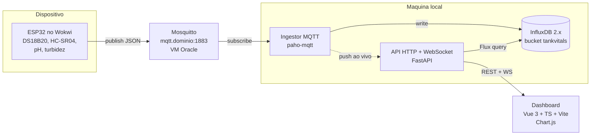

# TankVitals

**Monitoramento IoT de tanque de aquicultura / aquário em tempo real.**

Projeto da disciplina **Web II — UniFACEF 2026 — 1º Bimestre**.

Fluxo: `ESP32 (Wokwi) → MQTT → Mosquitto → Python → InfluxDB → Vue 3 + TypeScript`

---

## 1. O problema real

Tanques de criação de peixes e aquários de exposição dependem de uma faixa
estreita de qualidade da água. Fora dela, o prejuízo é rápido e irreversível:

| Situação | Consequência | Janela de tempo |
| --- | --- | --- |
| Temperatura sobe acima de 30 °C | queda do oxigênio dissolvido, estresse térmico, mortandade | horas |
| pH sai da faixa 6,5–8,0 | queima de brânquias, amônia vira tóxica | horas |
| Nível cai (evaporação / vazamento) | bomba trabalha seca e queima; concentração de amônia sobe | horas a 1 dia |
| Turbidez sobe | matéria orgânica em decomposição, filtro saturado | dias |

Hoje o acompanhamento é **manual e amostral**: alguém mede com termômetro e kit
de pH uma ou duas vezes por dia e anota em caderno. O problema não está em
medir — está em **não perceber a variação entre as medições** e em **não ter
histórico** para descobrir a causa depois que o problema já aconteceu.

### O que o TankVitals resolve

1. **Medição contínua** — leitura automática a cada 5 segundos, sem depender de
   alguém estar presente.
2. **Visibilidade imediata** — dashboard Web mostrando o estado atual de cada
   grandeza com indicação clara de dentro/fora da faixa segura.
3. **Histórico consultável** — série temporal armazenada no InfluxDB,
   permitindo responder "o que aconteceu na madrugada de ontem?".
4. **Detecção de anomalia** — o sistema compara cada leitura com faixas seguras
   configuráveis e sinaliza atenção/crítico (no dashboard e no LED do próprio
   dispositivo).

### Grandezas monitoradas

| Grandeza | Sensor | Faixa segura | Por que importa |
| --- | --- | --- | --- |
| Temperatura da água (°C) | DS18B20 | 24,0 – 28,0 | controla metabolismo e oxigênio dissolvido |
| pH | sonda analógica (potenciômetro no Wokwi) | 6,5 – 8,0 | fora da faixa a amônia se torna tóxica |
| Nível da água (%) | HC-SR04 (ultrassônico) | > 30 % | protege a bomba e evita concentração de poluentes |
| Turbidez (NTU) | sensor óptico (LDR no Wokwi) | < 40 | indica carga orgânica e saturação do filtro |

> As faixas acima são o contrato do sistema e estão replicadas em três lugares:
> firmware (LED local), backend (regra de alerta) e dashboard (cores).
> Ver [ARQUITETURA.md](docs/ARQUITETURA.md#5-faixas-seguras-e-regra-de-alerta).

---

## 2. Arquitetura



O detalhamento de cada contrato (tópicos, payload, schema do banco, endpoints)
está em **[docs/ARQUITETURA.md](docs/ARQUITETURA.md)**.

### Onde o broker roda, e por quê

O ESP32 simulado no Wokwi roda na nuvem e **não enxerga a rede local** da
equipe — ele precisa de um broker com endereço público.

- **Padrão** — o Mosquitto roda numa **VM gratuita da Oracle**, em
  `mqtt.<dominio>:1883`, com usuário e senha. InfluxDB, backend e frontend
  continuam na máquina local: todos fazem conexão *de saída* para o broker, sem
  precisar de porta aberta.
- **Plano B** — o ESP32 publica no `test.mosquitto.org` (que é uma instância
  pública do próprio Mosquitto) e um Mosquitto local importa o tópico por
  *bridge*.

Detalhes e passo a passo em [TAREFAS.md](docs/TAREFAS.md) (INFRA-03 e INFRA-04),
e a discussão completa na [ARQUITETURA §7](docs/ARQUITETURA.md#7-conectividade-wokwi--mosquitto).

---

## 3. Stack

| Camada | Tecnologia | Onde vive |
| --- | --- | --- |
| Dispositivo | ESP32 simulado no Wokwi (C++/Arduino) | `firmware/wokwi/` |
| Comunicação | MQTT 3.1.1 | tópicos `tankvitals/#` |
| Broker | Eclipse Mosquitto 2.x | `infra/mosquitto/` |
| Backend | Python 3.13 — paho-mqtt + FastAPI + influxdb-client | `backend/` |
| Banco de série temporal | InfluxDB 2.7 | `infra/` (Docker) |
| Frontend | Vue 3 + TypeScript + Vite | `frontend/` |
| Visualização | Chart.js (via vue-chartjs) | `frontend/src/components/` |
| Versionamento | Git + GitHub | este repositório |

---

## 4. Estrutura do repositório

```
TankVitals/
├─ README.md                       <- problema, arquitetura e stack
├─ .env.example                    <- modelo de configuração (copie para .env)
├─ docs/
│  ├─ ARQUITETURA.md               <- contratos: MQTT, JSON, InfluxDB, API
│  ├─ TAREFAS.md                   <- backlog com passo a passo e aceite
│  └─ PADROES-DESENVOLVIMENTO.md   <- branch, commit, PR e receitas de Git
├─ firmware/wokwi/                 <- circuito e sketch do ESP32 (FW-01..05)
├─ backend/
│  ├─ app/                         <- BE-01..08: config, models, alerts,
│  │                                  influx_repo, mqtt_ingestor, api, main
│  ├─ tools/fake_device.py         <- BE-09: publicador falso p/ desenvolver
│  ├─ tests/                       <- BE-09
│  └─ requirements.txt
├─ frontend/                       <- FE-01..08: Vue 3 + TS + Vite + Chart.js
└─ infra/
   ├─ docker-compose.yml           <- INFRA-01: Mosquitto + InfluxDB
   └─ mosquitto/config/            <- config local e da VM (INFRA-01, INFRA-03)
```

---

## 5. Estado atual

| Frente | Situação |
| --- | --- |
| Definição do problema | ✅ documentado (este README) |
| Arquitetura e contratos (MQTT, JSON, InfluxDB, API) | ✅ fechados em [docs/ARQUITETURA.md](docs/ARQUITETURA.md) |
| Backlog de implementação | ✅ escrito em [docs/TAREFAS.md](docs/TAREFAS.md) |
| Projeto Vue criado (Vite + TS + Chart.js instalados) | ✅ `npm run build` passando |
| Projeto Python criado (dependências instaladas) | ✅ `pytest` rodando |
| Arquivos de Docker e Mosquitto | ✅ criados, faltam os `TODO` da INFRA-01 |
| Infraestrutura no ar (Mosquitto + InfluxDB) | ⬜ INFRA-01..05 |
| Circuito no Wokwi e leitura dos 4 sensores | ✅ FW-01 e FW-02 |
| Firmware: Wi-Fi, MQTT e publicação | ⬜ FW-03..05 |
| Backend Python | ⬜ BE-01..09 |
| Frontend Vue 3 | ⬜ FE-01..08 |

O ponto de partida já está montado: projetos criados, dependências instaladas e
os contratos definidos. O que falta é a implementação, e ela está quebrada em
tarefas com passo a passo e critério de aceite em
**[docs/TAREFAS.md](docs/TAREFAS.md)** — comece por lá.

Para criar branch, escrever commit e abrir PR, veja o
[guia de desenvolvimento](docs/PADROES-DESENVOLVIMENTO.md).

---

## 6. Continuidade no 2º bimestre

A base já foi desenhada prevendo a ampliação:

- tópico `tankvitals/<tank>/cmd` já é assinado pelo firmware (atuação remota:
  alterar intervalo de leitura, futuramente acionar aerador/bomba);
- `tank_id` é *tag* no InfluxDB, então múltiplos tanques entram sem migração;
- mensagem de status com *Last Will* já permite detectar dispositivo offline;
- WebSocket no backend já prevê push em tempo real para alarmes.

---
